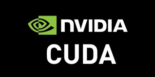

# AutoPilot Demo 

> This is the final project in the 2021 Winter Camp of Cambridge University and I am following the Prof. Thomas. 
>
> Author: Beal.MS(河明山)
>
> Date: 2021/2/25


## ROS Packages for AutoPilot(Turtlebot3) Demo 

|                           Version                            |                           License                            |                             Size                             |                            Noetic                            |
| :----------------------------------------------------------: | :----------------------------------------------------------: | :----------------------------------------------------------: | :----------------------------------------------------------: |
|  |  |  |  |

------

## Run Environment

* Operating System: Ubuntu 20.04<code></code>
* Tensorflow: 2.4.1<code></code>
* Cuda: 11.2.0 <code></code>

* Python: 3.8.5 <code></code>
* Robot Operate System: Noetic<code></code>

------

## Object Detector

  This module consists of training model and application model. The part of the training model is mainly supported by [Tensorflow Api](https://github.com/tensorflow/models). The preliminary work is the calibration and processing of the data set, and then the model training is completed according to the target detection training step in [Tensorflow Api](https://github.com/tensorflow/models). The part of the application model is mainly provided by ROS exactly tensorflow object detection which is in the vision folder. The model prediction is performed by calling the camera data, and finally the target detection result is output to the image.

------

**Command:**

```bash
# Training the model
$ python3 object_detection/model_main_tf2.py \
--pipeline_config_path="/home/hemingshan/auto_ws/src/vision/ssd_mobilenet_v2_fpnlite_320x320_coco17_tpu-8/pipeline.config"\
--model_dir="/home/hemingshan/auto_ws/src/vision/training"\
--alsologtostderr\
$ python3 object_detection/export_inference_graph.py\
--input_type image_tensor \
--pipeline_config_path="/home/hemingshan/auto_ws/src/vision/ssd_mobilenet_v2_fpnlite_320x320_coco17_tpu-8/pipeline.config" \
--trained_checkpoint_prefix="/home/hemingshan/auto_ws/src/vision/training/checkpoint.ckpt" \
--output_directory="/home/hemingshan/model"\
```

```bash
# Run the file
$ roslaunch turtlebot3_gazebo turtlebot3_autorace.launch
$ rosrun tensorflow_object_detector detect_ros.py 
$ rqt_image_view
```

------

### The model training progress visualized by tensorboard:


------

### The result in the simulation:


------

## Lane Detector

  The pavement detection module is mainly to enable the car to follow the traffic rules to operate within the range of the road. There are two methods for comparison in this module. The first is to use opencv's image processing and PID control method to complete the task of the module, but through the following figure, it can be found that this method will cause the existence of other routes that do not continue to move according to the current path after identifying other routes. Happening. In order to improve this method, adjust the position of the camera and aim it at the ground instead of facing forward as in the previous method, which shows that the position of the camera is very important.

------

**Command:**

```bash
$ roslaunch turtlebot3_gazebo turtlebot3_auto.launch
$ rosrun tensorflow_object_detector detect_lane.py 
```

------

### The result used the first method:


------

### The result used the second method which have a better performance:


## Obstacle Avoidance

  In the obstacle avoidance algorithm, the principle of lidar ranging is simply used. After the obstacle is identified, the specific location is located, and finally the obstacle avoidance route is predicted through a simple A* algorithm. Here, Git mainly uses the following [innovative ideas](https://github.com/zacdeng/Obstacle-avoidance-for-smartcar-with-monocular-vision-.git) of my classmates

  The result in the simulation:

